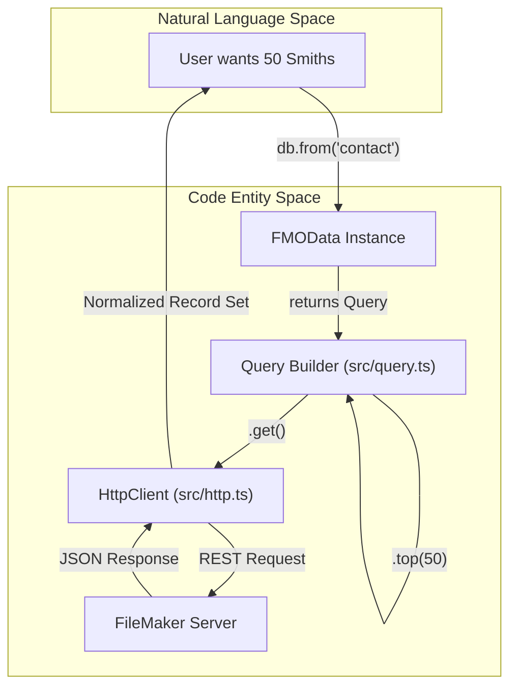
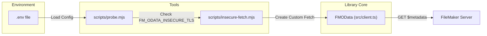

# Getting Started

This page provides a step-by-step guide for integrating `fm-odata-js` into your project. It covers installation, environment configuration, and executing your first FileMaker OData queries.

## Installation

The library is designed with zero runtime dependencies and is distributed as a single ES module [README.md:7-11]().

### From GitHub
Until the package is published to the npm registry, you can install it directly from the repository:
```bash
npm install github:fsans/fm-odata-js
```
[README.md:52-53]()

### Local Development
For contributors or those using a local clone, install via the local path:
```bash
npm install /path/to/fm-odata-js
```
[README.md:58-59]()

## Environment Configuration

The library includes a `.env.sample` template to facilitate local development and integration testing against a live FileMaker Server (FMS).

### Configuration Steps
1. Copy `.env.sample` to `.env` in your project root [README.md:143-144]().
2. Populate the following variables:

| Variable | Description |
| :--- | :--- |
| `FM_ODATA_HOST` | The HTTPS URL of your FileMaker Server (e.g., `https://fms.example.com`) [`.env.sample:11`]() |
| `FM_ODATA_DATABASE` | The case-sensitive name of the FileMaker file [`.env.sample:14`]() |
| `FM_ODATA_USER` | FMS account with `fmodata` extended privileges [`.env.sample:19`]() |
| `FM_ODATA_PASSWORD` | Password for the FMS account [`.env.sample:20`]() |
| `FM_ODATA_INSECURE_TLS` | Set to `1` to allow self-signed certificates on LAN [`.env.sample:30`]() |

**Note:** The `.env` file is git-ignored by default to prevent credential leakage [`.gitignore:13`]().

### Enabling Insecure TLS
FileMaker Server OData requires HTTPS. In local development environments using self-signed certificates, Node.js will reject the connection by default. You can bypass this by setting `FM_ODATA_INSECURE_TLS=1` in your `.env` [README.md:151]().

Sources: [`.env.sample:1-31`](), [`.gitignore:1-18`](), [`README.md:142-151`]()

## Instantiating FMOData

The `FMOData` class is the primary entry point for all operations. It requires a configuration object defining the host, database, and authentication.

### Authentication Quirk
FileMaker Server OData requires **HTTP Basic Authentication** [README.md:82](). The library provides a `basicAuth` helper to format these credentials correctly.

```typescript
import { FMOData, basicAuth } from 'fm-odata-js';

const db = new FMOData({
  host: process.env.FM_ODATA_HOST,
  database: process.env.FM_ODATA_DATABASE,
  token: basicAuth(process.env.FM_ODATA_USER, process.env.FM_ODATA_PASSWORD),
  timeoutMs: 15000, // Optional: defaults to 30 seconds
});
```
[README.md:77-84]()

## Running Your First Query

The library uses a fluent, chainable API to build OData queries. The `from(entitySet)` method initiates a `Query<T>` object.

### Data Flow: Query to Execution

The following diagram illustrates the flow from defining a query to receiving data from FileMaker Server.

**Query Execution Lifecycle**


### Example: Collection Read
```typescript
const { value, count } = await db
  .from('contact')
  .select('id', 'first_name', 'last_name')
  .filter((f) => f.eq('last_name', 'Smith'))
  .orderby('last_name')
  .top(50)
  .count() // Enables $count=true in the request
  .get();
```
[README.md:87-94]()

### Example: Single Record Operations
To target a specific record, use `byKey(id)`, which returns an `EntityRef` for targeted actions.

```typescript
// Fetch by Primary Key
const row = await db.from('contact').byKey(101).get();

// Update (PATCH)
await db.from('contact').byKey(101).patch({ first_name: 'Updated' });

// Delete
await db.from('contact').byKey(101).delete();
```
[README.md:103-105]()

Sources: [`README.md:74-106`]()

## Connectivity Probe

The repository includes a `probe.mjs` utility to verify your environment configuration and connectivity.

**System Connectivity Mapping**


Run the probe with:
```bash
npm run probe
```
This script attempts to fetch the `$metadata` of the database and counts rows in the configured tables to ensure permissions are correctly set [README.md:147]().

Sources: [`README.md:142-151`](), [`.env.sample:1-31`]()
