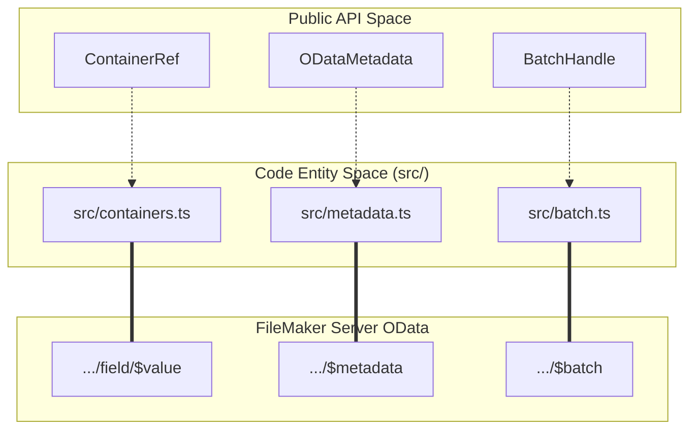
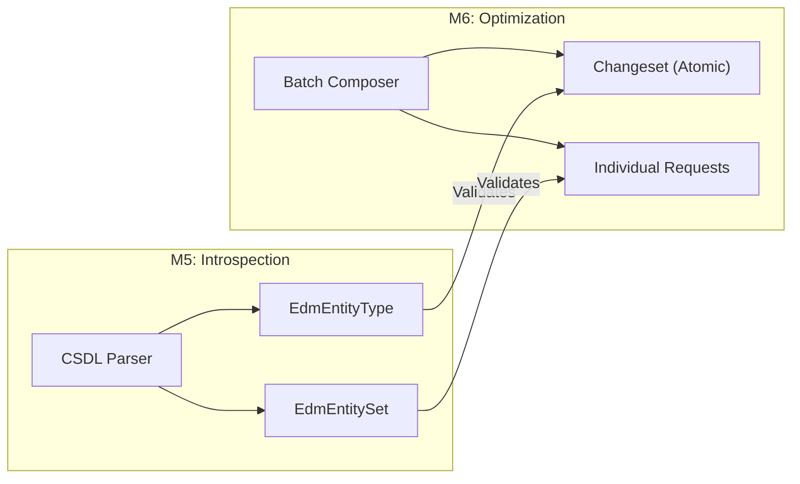

# Future Milestones (M4–M6)

This page provides a high-level overview of the planned features for milestones M4 through M6. These milestones focus on expanding the library's capabilities beyond basic CRUD and script execution to include binary data handling, schema introspection, and performance optimizations via request batching.

The roadmap is designed to keep the library lightweight, targeting a budget of approximately 1 KB gzipped per milestone [docs/m4-plan.md:10-12]().

## Milestone Roadmap

The development order is prioritized by risk-adjusted value, moving from self-contained features to complex protocol implementations.

| Milestone | Feature | Purpose |
| :--- | :--- | :--- |
| **M4** | **Containers** | Read, upload, and delete binary content in FileMaker container fields. |
| **M5** | **$metadata** | Fetch and parse the EDMX/CSDL XML to enable schema discovery. |
| **M6** | **$batch** | Combine multiple operations into a single multipart HTTP request. |

Sources: [docs/m4-plan.md:3-8]()

### Feature Architecture Mapping

The following diagram maps the planned public API components to their respective internal stub modules and the FileMaker Server (FMS) OData endpoints they interact with.

**Planned Entity Relationships**

Sources: [src/containers.ts:1-2](), [src/metadata.ts:1-2](), [src/batch.ts:1-2](), [docs/m4-plan.md:108-110]()

---

## Containers (M4)

The M4 milestone introduces the `ContainerRef` class to manage binary I/O for FileMaker container fields. This includes support for downloading files as Blobs or Streams, uploading data with proper `Content-Type` headers, and deleting container content.

Key features include:
*   **Filename Parsing**: Extracting filenames from the `Content-Disposition` header [docs/m4-plan.md:127-128]().
*   **Stream Support**: Utilizing `getStream()` to handle large files without buffering them entirely in memory [docs/m4-plan.md:117-118]().
*   **Empty Handling**: Treating `Content-Length: 0` responses as null or empty containers [docs/m4-plan.md:115-116]().

For details on the `ContainerRef` API and implementation, see [Containers (M4)](#5.1).

Sources: [docs/m4-plan.md:99-147](), [src/containers.ts:1-2]()

---

## Metadata and Batch (M5–M6)

These milestones focus on advanced OData protocol features that improve developer experience and network efficiency.

### $metadata Parsing (M5)
M5 introduces a lightweight XML parser for the `$metadata` endpoint. This allows the library to programmatically discover:
*   **EntitySets**: Available tables/layouts.
*   **EdmEntityType**: Field names and types (e.g., distinguishing between `Edm.String` and `Edm.DateTimeOffset`).
*   **Actions**: Available FileMaker scripts exposed as OData actions.

This metadata layer is the foundation for future code generation tools that can produce TypeScript interfaces directly from a FileMaker database schema.

### $batch Multipart (M6)
M6 implements the OData `$batch` protocol, allowing multiple operations (GET, POST, PATCH, DELETE) to be sent in a single `multipart/mixed` HTTP request.
*   **Atomicity**: Support for `Changesets` where all operations succeed or fail together.
*   **Performance**: Reducing round-trips for high-latency connections.

For details on the CSDL parser and batch composer designs, see [Metadata and Batch (M5–M6)](#5.2).

**Milestone Logic Flow**

Sources: [docs/m4-plan.md:7-8](), [src/metadata.ts:1-2](), [src/batch.ts:1-2]()
