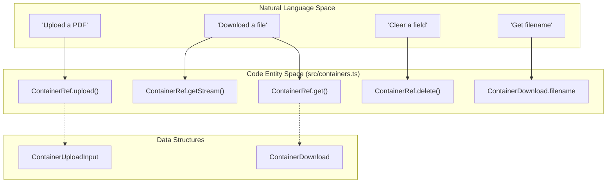
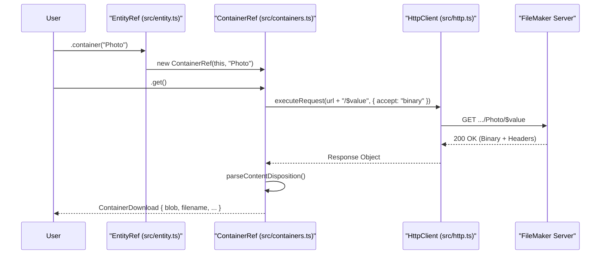

# Containers (M4)

The **Containers (M4)** milestone introduces the `ContainerRef` API, a dedicated system for interacting with FileMaker container field binary data. While standard OData fields are handled via JSON, FileMaker containers require specialized interactions with the `/$value` endpoint for streaming, uploading, and deleting binary content [docs/m4-plan.md:103-111]().

## Overview and Purpose

The Container API is designed to handle binary I/O without unnecessary memory buffering, supporting `Blob`, `ArrayBuffer`, and `Uint8Array` types across both Browser and Node.js (18+) environments [docs/m4-plan.md:117-135]().

### Key Features
- **Streaming Support**: Direct access to `ReadableStream` for large file processing [docs/m4-plan.md:141-141]().
- **Metadata Parsing**: Automatic extraction of filenames from the `Content-Disposition` header [docs/m4-plan.md:153-153]().
- **Empty State Handling**: Graceful handling of `Content-Length: 0` responses for empty container fields [docs/m4-plan.md:116-116]().
- **Typed Uploads**: Enforced `Content-Type` requirements for binary persistence [docs/m4-plan.md:109-109]().

---

## Code Entity Mapping

The following diagram maps the natural language requirements for container operations to the specific classes and methods implemented in the codebase.

**Container API Entity Map**

Sources: [docs/m4-plan.md:124-145]()

---

## Implementation Details

### Data Flow: Container Download
When `ContainerRef.get()` is called, the library executes a `GET` request to the specific container field's `$value` endpoint. Unlike standard queries, this request uses `accept: 'binary'` to bypass JSON parsing [docs/m4-plan.md:153-153]().

1. **URL Construction**: The URL is built by appending the field name and `/$value` to the parent entity's URL: `/{EntitySet}({key})/{containerField}/$value` [docs/m4-plan.md:108-108](), [docs/m4-plan.md:152-152]().
2. **Header Parsing**: The library parses the `Content-Disposition` header to extract filenames, supporting both standard `filename="name.ext"` and RFC 5987 `filename*=UTF-8''name.ext` formats [docs/m4-plan.md:153-153](), [docs/m4-plan.md:164-164]().
3. **Empty Handling**: If FileMaker Server returns `Content-Length: 0`, the library returns a `size: 0` object with an empty blob rather than throwing an error [docs/m4-plan.md:116-116](), [docs/m4-plan.md:165-165]().

### Data Flow: Container Upload
Uploading data via `ContainerRef.upload()` uses the `PUT` method [docs/m4-plan.md:109-109]().

1. **Input Transformation**: The `ContainerUploadInput` accepts `Blob`, `ArrayBuffer`, or `Uint8Array`. These are passed directly to the underlying `fetch` implementation [docs/m4-plan.md:131-135](), [docs/m4-plan.md:155-155]().
2. **Headers**: The `Content-Type` is mandatory. If a `filename` is provided in the input, the library generates a `Content-Disposition: attachment; filename="..."` header [docs/m4-plan.md:134-134](), [docs/m4-plan.md:155-155]().

---

## Class Reference

### ContainerRef
The primary class for container operations, instantiated via `EntityRef.container(fieldName)` [docs/m4-plan.md:147-147]().

| Method | Return Type | Description |
| :--- | :--- | :--- |
| `get(opts?)` | `Promise<ContainerDownload>` | Fetches the binary data and metadata [docs/m4-plan.md:140-140](). |
| `getStream(opts?)` | `Promise<ReadableStream>` | Returns the raw response body stream [docs/m4-plan.md:141-141](). |
| `upload(input, opts?)` | `Promise<void>` | Uploads binary data using `PUT` [docs/m4-plan.md:142-142](). |
| `delete(opts?)` | `Promise<void>` | Clears the container field using `DELETE` [docs/m4-plan.md:143-143](). |
| `url()` | `string` | Returns the fully qualified `$value` URL [docs/m4-plan.md:139-139](). |

### Interfaces

**ContainerDownload** [docs/m4-plan.md:124-129]()
- `blob: Blob`: The binary content.
- `contentType: string`: The MIME type returned by the server.
- `filename?: string`: The parsed filename from headers.
- `size: number`: Total byte size.

**ContainerUploadInput** [docs/m4-plan.md:131-135]()
- `data: Blob | ArrayBuffer | Uint8Array`: The payload.
- `contentType: string`: The MIME type for the `Content-Type` header.
- `filename?: string`: Optional filename for the `Content-Disposition` header.

---

## Architectural Interaction

The following diagram illustrates how `ContainerRef` interacts with the core `HttpClient` and `EntityRef` to perform operations.

**Container Operation Sequence**

Sources: [docs/m4-plan.md:137-158](), [src/containers.ts:1-2]()

---

## Error Handling
Container operations follow the standard error flow of the library. If a `PUT` or `GET` request fails (e.g., 404 Not Found or 401 Unauthorized), the response is passed to `parseErrorResponse` to generate a typed `FMODataError` [docs/m4-plan.md:170-170](). 

Specific to containers:
- `getStream()` will throw an error if the response body is `null` [docs/m4-plan.md:166-166]().
- `delete()` expects a `204 No Content` response; any other successful status is treated as an anomaly [docs/m4-plan.md:156-156]().

Sources: [docs/m4-plan.md:150-170](), [src/containers.ts:1-2]()
