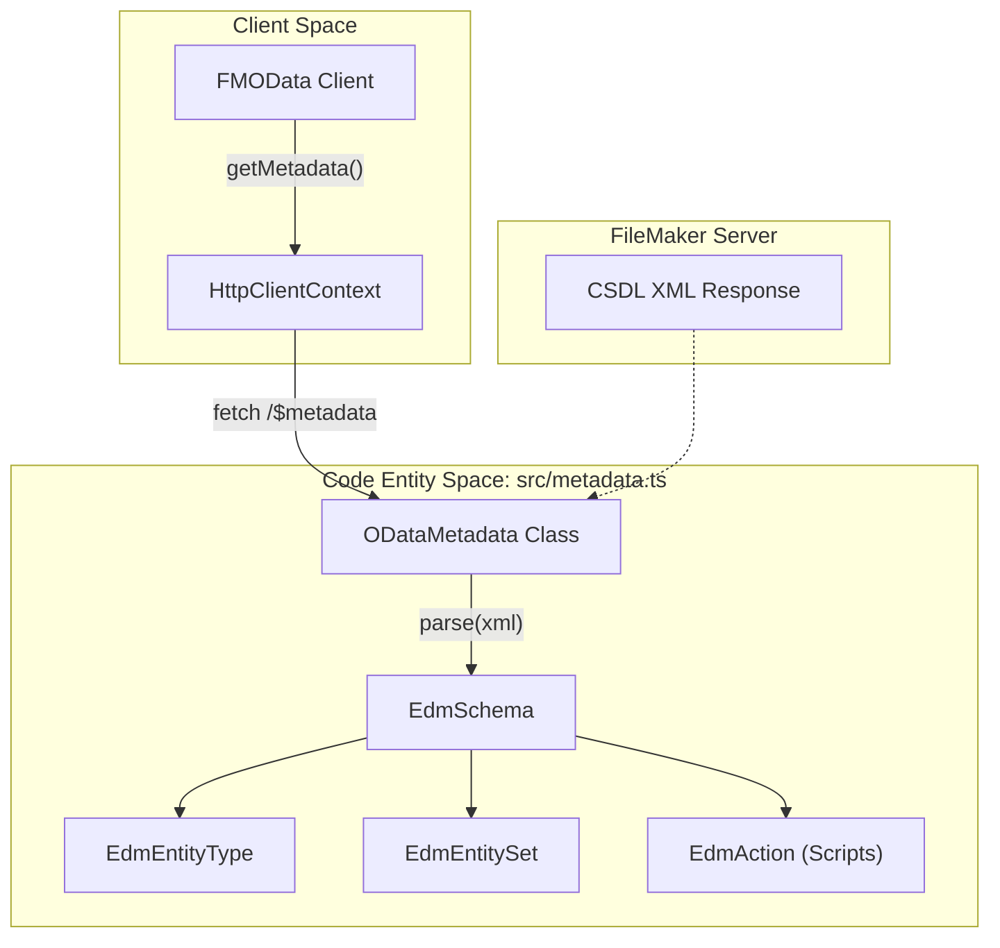
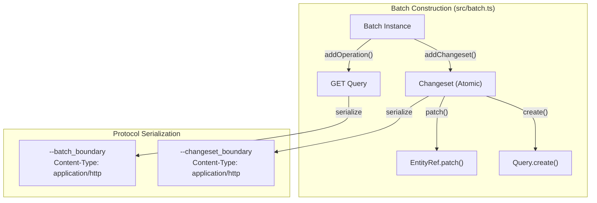

# Metadata and Batch (M5–M6)

Milestones M5 and M6 focus on schema introspection and transactional operations. These features allow `fm-odata-js` to transition from a manual query builder to a schema-aware client capable of complex, atomic interactions with FileMaker Server.

## Overview and Design Goals

The implementation of Metadata and Batch is guided by the library's strict bundle-size constraints and zero-dependency philosophy. As defined in the development roadmap, each part targets a ~1 KB gzipped budget to maintain the library's lightweight footprint [docs/m4-plan.md:10-12]().

| Feature | Milestone | Primary Goal | Key Code Entities |
| :--- | :--- | :--- | :--- |
| **$metadata** | M5 | Parse CSDL XML into a traversable schema object. | `ODataMetadata`, `EdmEntityType`, `EdmEntitySet` |
| **$batch** | M6 | Compose multipart/mixed requests for atomicity. | `Batch`, `Changeset`, `BatchHandle` |

---

## Milestone 5: Metadata (CSDL Parser)

Milestone 5 introduces the ability to fetch and parse the OData service metadata document (`$metadata`). This is critical for unlocking future code generation and runtime validation of field names and types.

### Implementation Strategy
The parser is located in `src/metadata.ts` [src/metadata.ts:1-2](). Because the library targets both Node.js and Browser environments without external dependencies, it uses a lightweight, regex-based or stream-based XML approach rather than a full DOM parser to minimize size.

### Data Flow: Metadata Retrieval
The following diagram illustrates the flow from the `FMOData` client to the parsed metadata object.

**Metadata Resolution Flow**

Sources: [src/metadata.ts:1-2](), [docs/m4-plan.md:7-7]()

### Key Metadata Entities
1.  **`ODataMetadata`**: The root container for the parsed schema. It provides methods to find entity sets by name.
2.  **`EdmEntityType`**: Represents a FileMaker Table occurrence, including property names and OData types (e.g., `Edm.String`, `Edm.Decimal`).
3.  **`EdmAction`**: Maps to FileMaker Scripts exposed via OData. This allows the client to discover required `scriptParameter` requirements programmatically.

---

## Milestone 6: Batch Processing

Milestone 6 implements the `$batch` endpoint, allowing multiple operations (POST, PATCH, DELETE) to be grouped into a single HTTP request. This is essential for maintaining **atomicity** (all operations succeed or all fail) within a `Changeset`.

### Multipart Composition
Batch requests use the `multipart/mixed` content type. The library handles the generation of unique boundaries and the encoding of nested HTTP requests within the body.

### Logical Structure of a Batch
A `Batch` can contain individual `GET` requests or `Changesets`. A `Changeset` is an atomic unit containing one or more data-modifying operations.

**Batch and Changeset Mapping**

Sources: [src/batch.ts:1-2](), [docs/m4-plan.md:8-8]()

### Implementation Details
*   **`BatchHandle`**: When a request is added to a batch, the library returns a handle. Once the batch is executed via `client.sendBatch(batch)`, the handles are resolved with their specific results.
*   **Atomicity Semantics**: Operations inside a `Changeset` are processed by FileMaker Server as a single transaction. If any operation fails, the server rolls back all changes within that specific changeset.

---

## Integration and Testing Plans

### Bundle Size Budget
To adhere to the project's performance goals, the following budgets are strictly enforced:
*   **Metadata Parser**: ≤ 1.0 KB gzipped.
*   **Batch Composer/Decoder**: ≤ 1.2 KB gzipped.

### Test Strategy
Testing for M5 and M6 involves complex mock responses to simulate multipart bodies and XML schema definitions.

| Test Type | Scope | Key Scenarios |
| :--- | :--- | :--- |
| **Unit** | `tests/unit/metadata.test.ts` | Parsing complex CSDL with multiple namespaces and scripts. |
| **Unit** | `tests/unit/batch.test.ts` | Correct boundary generation and multipart preamble/epilogue. |
| **Integration** | `tests/integration/batch.test.ts` | Executing a 5-record creation changeset against `Contacts.fmp12`. |

Sources: [docs/m4-plan.md:10-12](), [src/batch.ts:1-2](), [src/metadata.ts:1-2]()
